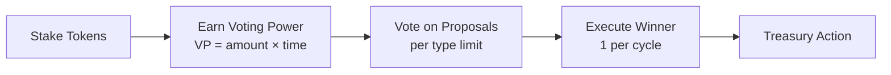

# Governance Glossary

## Flow Diagram



## Core Contracts

### LevrStaking_v1

Escrows project tokens. Users stake to receive LevrStakedToken_v1 (1:1 ratio). Handles multi-token reward distribution via delta-based accounting.

### LevrStakedToken_v1

ERC-20 receipt token representing staked balance. Source of governance voting power.

### LevrGovernor_v1

Manages proposal lifecycle, enforces voting rules, snapshots voting power, and executes winning proposals via treasury.

### LevrTreasury_v1

Holds project funds. Executes authorized actions: boost staking rewards or transfer to designated address.

### LevrFactory_v1

Global registry and configuration source. All governance parameters are defined here. Supports verified projects with custom config overrides.

## Verified Projects

**NEW:** Factory owner can verify trusted projects, allowing them to override factory config parameters.

### Verification Flow

1. **Factory Owner** calls `verifyProject(clankerToken)` → initializes override config
2. **Project Admin** calls `updateProjectConfig(clankerToken, customConfig)` → customizes settings
3. **Automatic Resolution** → Governor/Staking automatically use project config

### What Can Be Overridden

Verified projects can customize:

- ✅ Proposal window (faster/slower governance)
- ✅ Voting window
- ✅ Quorum and approval thresholds (stricter/looser requirements)
- ✅ Max active proposals per type
- ✅ Minimum stake to submit proposals
- ✅ Max proposal amount limits
- ✅ Streaming window (reward vesting duration)
- ✅ Max reward tokens
- ❌ **Protocol fee BPS** (NOT overridable - protocol revenue protected)

### Example Use Cases

**Established Project (Faster Governance):**

- Proposal window: 1 day (vs 2 day default)
- Voting window: 3 days (vs 5 day default)
- Result: Complete cycle in 4 days instead of 7

**High-Value Treasury (Stricter Security):**

- Quorum: 90% (vs 70% default)
- Approval: 75% (vs 51% default)
- Min stake to submit: 5% (vs 1% default)
- Result: Higher bar for treasury access

**Experimental Project (More Flexible):**

- Max active proposals: 20 (vs 7 default)
- Streaming window: 14 days (vs 7 default)
- Result: More concurrent governance, longer reward vesting

## Governance Parameters (Factory Config)

| Parameter               | Type   | Description                                                                        |
| ----------------------- | ------ | ---------------------------------------------------------------------------------- |
| `proposalWindowSeconds` | uint32 | Duration of proposal submission window                                             |
| `votingWindowSeconds`   | uint32 | Duration of voting window after proposals close                                    |
| `maxActiveProposals`    | uint16 | Maximum concurrent active proposals **per type** (e.g., 7 per type = 14 total max) |
| `quorumBps`             | uint16 | Minimum participation threshold (basis points, e.g., 7000 = 70%)                   |
| `approvalBps`           | uint16 | Minimum yes-vote threshold (basis points, e.g., 5100 = 51%)                        |
| `minSTokenBpsToSubmit`  | uint16 | Minimum % of total sToken supply required to submit (basis points, e.g., 100 = 1%) |

## Staking Mechanics

### Stake

- **Action**: User deposits project tokens → receives sToken 1:1
- **Time Tracking**: If user's amount was 0, sets `startTime = block.timestamp`
- **Top-up**: Adding more tokens does NOT reset `startTime`

### Unstake

- **Action**: User burns sToken → receives project tokens 1:1
- **Time Reset**: Any unstake (partial or full) resets `startTime = 0`

### Claim Rewards

- **Action**: User claims accrued rewards from staking pool
- **Time Preservation**: Does NOT reset `startTime`

## Voting Power

### Formula

```
VP_user = amount_staked × time_staked
time_staked = block.timestamp - startTime (seconds)
```

### Snapshot

Voting power is calculated on-demand when users vote to prevent manipulation:

- VP calculated at vote time: `balance × (proposal.createdAt - stakeStartTime)`
- Returns 0 if user staked after proposal was created
- Cached in `vpSnapshot[proposalId][user]` after first calculation

## Proposal Types

### 1. Boost Staking Pool

Transfers tokens from Treasury → Staking contract to increase reward pool.

### 2. Transfer to Address

Transfers tokens from Treasury → specified address for any purpose.

## Governance Cycle

### Timeline

```
[Proposal Window: proposalWindowSeconds] → [Voting Window: votingWindowSeconds] → [Execution]
```

### Proposal Creation

- **When**: Only during proposal window (configurable start time + `proposalWindowSeconds`)
- **Who**: Users with ≥ `minSTokenBpsToSubmit` % of total sToken supply
- **Limit**: Maximum `maxActiveProposals` concurrent proposals **per type** (Boost and Transfer have separate limits)

### Voting

- **When**: Proposal window end → voting window end (`votingWindowSeconds`)
- **Options**: Yes / No / Abstain
- **Weight**: Based on snapshot VP at proposal creation

### Execution

- **Timing**: After voting window closes
- **Winner Selection**: Among proposals meeting quorum + approval:
  - Must reach ≥ `quorumBps` participation: `totalBalanceVoted ≥ (quorumBps / 10000) × totalSupply`
  - Must reach ≥ `approvalBps` approval: `yesVotes ≥ (approvalBps / 10000) × (yesVotes + noVotes)`
  - Pick proposal with highest YES votes (VP-weighted)
- **Tie-break**: Lower proposalId wins (or none execute if strict)
- **Limit**: Only 1 proposal executes per cycle

**Note**: Quorum uses balance participation (fair representation), approval uses VP weighting (rewards long-term commitment)

## Data Structures

### Staking State

```c++
struct Stake {
    uint256 amount;      // Staked balance
    uint256 startTime;   // Time tracking started (0 if none)
}
mapping(address => Stake) stakes;
```

### Voting State

```c++
struct Proposal {
    uint256 id;
    ProposalType proposalType;
    address proposer;
    uint256 amount;
    address recipient;
    uint256 createdAt;
    uint256 votingStartsAt;
    uint256 votingEndsAt;
    uint256 yesVotes;              // VP-weighted yes votes
    uint256 noVotes;               // VP-weighted no votes
    uint256 totalBalanceVoted;     // sToken balance that voted (for quorum)
    bool executed;
    uint256 cycleId;
}

mapping(uint256 proposalId => Proposal) proposals;
mapping(uint256 proposalId => mapping(address user => uint256 vp)) vpSnapshot;  // Calculated on-demand
mapping(uint256 proposalId => mapping(address user => VoteReceipt)) voteReceipts;
```

### Governance Windows

```c++
uint256 proposalStart;  // Configurable cycle start
uint256 proposalEnd = proposalStart + proposalWindowSeconds;
uint256 voteEnd = proposalEnd + votingWindowSeconds;
```

## Algorithms

### On Stake

```c++
if (stakes[user].amount == 0) {
    stakes[user].startTime = block.timestamp;
}
stakes[user].amount += depositAmount;
mint(user, depositAmount);  // sToken 1:1
```

### On Unstake

```c++
stakes[user].amount -= withdrawAmount;
stakes[user].startTime = 0;  // Reset timer
burn(user, withdrawAmount);  // sToken 1:1
```

### Calculate VP (On-Demand During Vote)

```c++
function calculateVP(proposalId, user):
    balance = sToken.balanceOf(user);
    if (balance == 0) return 0;

    startTime = staking.stakeStartTime(user);
    if (startTime == 0 || startTime >= proposal.createdAt) return 0;

    timeStaked = proposal.createdAt - startTime;
    return balance × timeStaked;
```

**Note**: VP calculated only when user votes (gas-efficient, no enumeration at proposal creation)

### Determine Winner

```c++
eligibleProposals = [];
totalSupply = sToken.totalSupply();

for each proposal p:
    // Check quorum: did enough token holders participate?
    if (p.totalBalanceVoted >= quorumBps / 10000 × totalSupply) {
        // Check approval: did yes votes win?
        totalVotes = p.yesVotes + p.noVotes;
        if (p.yesVotes >= approvalBps / 10000 × totalVotes) {
            eligibleProposals.push(p);
        }
    }

winner = argmax(eligibleProposals, by: yesVotes);  // Highest VP-weighted yes votes
```

**Quorum**: Measures % of token supply that voted (balance-based)  
**Approval**: Measures % preference strength (VP-weighted)

## Treasury Actions

### Boost Staking Pool

```md
1. Treasury transfers tokens → Staking contract
2. Staking measures balance delta
3. Delta credited as new rewards (prevents double-counting)
4. Rewards accrue to stakers over time
```

### Transfer to Address

```md
1. Treasury transfers tokens → specified recipient
2. Use case: team allocation, external incentives, etc.
```

## Front-end Integration

### Proposal Creation UI

- Query current time vs. proposal window
- Disable submit button outside window
- Check user's sToken balance ≥ `(minSTokenBpsToSubmit / 10000) × totalSupply`
- Display "X of maxActiveProposals" counter per proposal type (e.g., "Boost: 3/7, Transfer: 2/7")

### Voting UI

- Show time remaining in voting window
- Display user's VP for this proposal (calculated on-demand)
- Show quorum progress: `totalBalanceVoted / totalSupply` vs. `quorumBps / 10000`
- Show approval progress: `yesVotes / (yesVotes + noVotes)` vs. `approvalBps / 10000`
- Clarify: Quorum = "X% of token holders voted", Approval = "Y% voted yes (weighted by commitment)"

### Execution UI

- Enable "Execute" button only after voting window closes
- Highlight winning proposal (highest yes votes among eligible)
- Pre-check treasury balance before execution
- Handle tx states with standard error handling

## Guardrails

### Proposal Eligibility

- Minimum staked balance percentage (`minSTokenBpsToSubmit` of total supply)
- Proposal window timing enforcement
- Concurrency cap (`maxActiveProposals` per proposal type)

### Execution Safety

- Single winner per cycle (no multi-execution)
- Treasury balance checks (revert if insufficient)
- Only governor can call treasury actions

### Anti-Gaming

- VP snapshot at proposal start (no last-minute staking)
- Unstake resets time (discourages manipulation)
- Strict quorum + approval thresholds

---

## Reward Token Whitelisting System (v1.5.0+)

### Overview

The Levr protocol implements a **mandatory whitelist-only system** for reward tokens. Only explicitly whitelisted tokens can be used for staking rewards, preventing token spam and ensuring controlled reward distribution.

### Key Features

**1. Factory Initial Whitelist**

- Factory owner sets initial whitelist (e.g., WETH) at deployment
- All projects inherit factory whitelist automatically
- Projects can extend whitelist by whitelisting additional tokens

**2. Project-Level Control**

- Each project manages its own whitelisted tokens
- Token admin (underlying token owner) can whitelist/unwhitelist tokens
- Independent whitelists per project (no cross-contamination)

**3. Underlying Token Protection**

- Underlying token (project token) is auto-whitelisted and immutable
- Cannot call `whitelistToken(underlying)` - reverts with `CANNOT_MODIFY_UNDERLYING`
- Cannot call `unwhitelistToken(underlying)` - reverts with `CANNOT_UNWHITELIST_UNDERLYING`

**4. Reward State Safety**

- Cannot re-whitelist token with pending rewards - reverts with `CANNOT_WHITELIST_WITH_PENDING_REWARDS`
- Cannot unwhitelist token with claimable rewards - reverts with `CANNOT_UNWHITELIST_WITH_PENDING_REWARDS`
- Prevents fund loss and state corruption

**5. Enforcement Points**

- All reward accrual enforces whitelist: `_ensureRewardToken(token)` reverts with `TOKEN_NOT_WHITELISTED`
- Fee splitter distribution enforces whitelist
- Factory config tracks whitelisted status per token

### Whitelist Lifecycle

**New Token Flow:**

1. Token admin calls `whitelistToken(rewardToken)`
   - Validates token not already whitelisted
   - Validates no pending rewards (if token was used before)
   - Creates token state entry
2. Token is now usable for `accrueRewards(rewardToken)` in staking
3. Fee splitter can distribute this token as rewards

**Unwhitelist Flow:**

1. Token admin settles all pending rewards for token
2. Requires both: `availablePool == 0` AND `streamTotal == 0`
3. Calls `unwhitelistToken(rewardToken)` - sets `whitelisted = false`
4. Token no longer accepted in reward accrual or distribution

**Re-whitelist Flow:**

1. Token was previously used and unwhitelisted
2. Token admin calls `whitelistToken(rewardToken)` again
3. Validates no pending rewards from previous state
4. Can now use token for new rewards

### Factory Configuration

New parameter in factory initialization:

```solidity
address[] memory _initialWhitelistedTokens  // NEW
```

**Deployment Example:**

```solidity
address[] memory initialWhitelist = new address[](1);
initialWhitelist[0] = WETH_ADDRESS;  // Factory canonical reward token

ILevrFactory_v1.ConfigBounds memory bounds = ILevrFactory_v1.ConfigBounds({
    minStreamWindowSeconds: 1 days,
    minProposalWindowSeconds: 6 hours,
    minVotingWindowSeconds: 2 days,
    minQuorumBps: 2000,
    minApprovalBps: 5000,
    minMinSTokenBpsToSubmit: 100,
    minMinimumQuorumBps: 25
});

factory = new LevrFactory_v1(
    config,
    bounds,
    owner,
    trustedForwarder,
    levrDeployer,
    initialWhitelist  // NEW
);
```

### Protocol Fee Protection (v1.5.0+ CRITICAL)

**Issue:** Verified projects could potentially override protocol fee in their config overrides.

**Fix:** Runtime enforcement ensures protocol fee and treasury always use factory values.

#### Implementation

```solidity
// BEFORE: Could store stale values
FactoryConfig storage existingCfg = _projectOverrideConfig[clankerToken];
FactoryConfig memory fullCfg = FactoryConfig({
    protocolFeeBps: existingCfg.protocolFeeBps,  // Could be stale!
    protocolTreasury: existingCfg.protocolTreasury,  // Could be stale!
    // ...
});

// AFTER: Always use current factory values
FactoryConfig memory fullCfg = FactoryConfig({
    protocolFeeBps: _protocolFeeBps,          // Always current ✅
    protocolTreasury: _protocolTreasury,      // Always current ✅
    // ... rest from project config ...
});
```

#### Protection Layers

1. **Struct Design** - `ProjectConfig` excludes `protocolFeeBps` and `protocolTreasury`
   - Projects cannot specify these fields at API level
   - Compile-time prevention

2. **Runtime Enforcement** - `updateProjectConfig()` always uses `_protocolFeeBps`
   - Factory state variables hold current values
   - No stale values possible
   - Automatic sync on factory updates

3. **Getter Isolation** - `protocolFeeBps()` function has no project override logic
   - Returns factory value directly
   - No delegation to project config

4. **Factory Control** - Only factory owner can change protocol fee
   - `setProtocolFeeBps()` requires `onlyOwner`
   - Changes apply to all projects immediately

#### Verification Matrix

| Scenario                        | Before                           | After                 | Status |
| ------------------------------- | -------------------------------- | --------------------- | ------ |
| Factory increases fee           | All projects sync automatically  | ✅ Tested             |
| Verified project updates config | Could use old fee value          | ✅ Uses current value |
| New project deployment          | Inherits factory fee             | ✅ Correct            |
| Factory lowers fee              | All projects immediately benefit | ✅ Tested             |
| Multiple fee changes            | No stale values possible         | ✅ Always current     |

### Test Coverage

**New test file: `test/unit/LevrFactory_VerifiedProjects.t.sol` (15 tests)**

**Protocol Fee Protection Tests (CRITICAL):**

- ✅ Verified projects cannot override protocol fee
- ✅ Factory protocol fee changes apply to all projects
- ✅ Project config updates always use current factory fee
- ✅ Multiple projects cannot override fee independently
- ✅ Protocol fee cannot be avoided with any config combination
- ✅ Factory owner maintains control over protocol revenue

**Result:** 6 comprehensive tests verify revenue protection

### Example: Verified Project with Custom Config

**Goal:** Faster governance while protecting protocol revenue

```solidity
// Project admin can customize governance
ProjectConfig memory customConfig = ProjectConfig({
    streamWindowSeconds: 7 days,
    proposalWindowSeconds: 3 days,      // Faster: 2 days → 3 days
    votingWindowSeconds: 4 days,        // Faster: 5 days → 4 days
    maxActiveProposals: 10,
    quorumBps: 6000,                    // ✅ Can override: 70% quorum
    approvalBps: 5500,                  // ✅ Can override: 55% approval
    minSTokenBpsToSubmit: 50,           // ✅ Can override: 0.5% min stake
    maxProposalAmountBps: 3000,         // ✅ Can override: 30% treasury limit
    minimumQuorumBps: 100               // ✅ Can override: 1% minimum
    // protocolFeeBps: ???               // ❌ NOT in struct - CANNOT override
    // protocolTreasury: ???             // ❌ NOT in struct - CANNOT override
});

factory.verifyProject(clankerToken);
factory.updateProjectConfig(clankerToken, customConfig);

// At runtime:
uint256 customQuorum = factory.quorumBps(clankerToken);      // 6000 (60%) ✅
uint16 protocolFee = factory.protocolFeeBps(clankerToken);   // _protocolFeeBps (factory) ✅
address protocolTx = factory.protocolTreasury(clankerToken); // _protocolTreasury (factory) ✅
```

### Security Guarantees

**Whitelist System:**
| Protection | Mechanism | Guarantee |
|-----------|-----------|-----------|
| Underlying immutability | Cannot modify underlying token | Cannot remove project's base token |
| State corruption | Pending rewards validation | Cannot corrupt reward pools |
| Fund loss | Unwhitelist validation | Cannot strand claimable rewards |
| Token spam | Admin-only whitelisting | Cannot DOS with dust tokens |

**Protocol Revenue (CRITICAL):**
| Protection | Mechanism | Guarantee |
|-----------|-----------|-----------|
| Struct exclusion | ProjectConfig omits fee fields | Cannot specify at API level |
| Runtime enforcement | Always use \_protocolFeeBps | Cannot use stale values |
| Getter isolation | No override in protocolFeeBps() | Cannot query project-specific fee |
| Auto-sync | Factory changes propagate immediately | All projects always current |
| Ownership control | Only factory owner controls fees | No delegation possible |

### Migration Guide (v1.4.0 → v1.5.0)

**Factory Deployment:**

```solidity
// BEFORE (v1.4.0)
factory = new LevrFactory_v1(config, owner, forwarder, deployer);

// AFTER (v1.5.0)
address[] memory initialWhitelist = new address[](1);
initialWhitelist[0] = WETH_ADDRESS;  // Factory's canonical reward token
ILevrFactory_v1.ConfigBounds memory bounds = ILevrFactory_v1.ConfigBounds({
    minStreamWindowSeconds: 1 days,
    minProposalWindowSeconds: 6 hours,
    minVotingWindowSeconds: 2 days,
    minQuorumBps: 2000,
    minApprovalBps: 5000,
    minMinSTokenBpsToSubmit: 100,
    minMinimumQuorumBps: 25
});
factory = new LevrFactory_v1(config, bounds, owner, forwarder, deployer, initialWhitelist);
```

**Test File Updates:**

```solidity
// BEFORE: Could use any token
function setUp() public {
    staking.initialize(underlying, stakedToken, treasury, factory);
    // Any token now works without whitelisting
}

// AFTER: Must whitelist tokens
function setUp() public {
    address[] memory rewardTokens = new address[](1);
    rewardTokens[0] = address(weth);
    initializeStakingWithRewardTokens(
        staking, underlying, stakedToken, treasury, factory, rewardTokens
    );
}
```

### Removed Features

- ❌ `maxRewardTokens` - Replaced with whitelist system
- ❌ `factory.maxRewardTokens(address)` - No longer exists
- ❌ `MAX_REWARD_TOKENS_REACHED` error - No longer needed

### Behavior Changes

- Cannot accrue rewards for non-whitelisted tokens → reverts with `TOKEN_NOT_WHITELISTED`
- Fee splitter rejects distribution of non-whitelisted tokens
- All deployment scripts must initialize factory with `initialWhitelistedTokens` array

---
