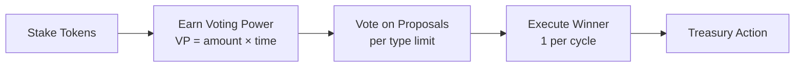

# Governance Glossary

## Flow Diagram



## Core Contracts

### LevrStaking_v1

Escrows project tokens. Users stake to receive LevrStakedToken_v1 (1:1 ratio). Handles multi-token reward distribution via delta-based accounting.

### LevrStakedToken_v1

ERC-20 receipt token representing staked balance. Source of governance voting power.

### LevrGovernor_v1

Manages proposal lifecycle, enforces voting rules, snapshots voting power, and executes winning proposals via treasury.

### LevrTreasury_v1

Holds project funds. Executes authorized actions: boost staking rewards or transfer to designated address.

### LevrFactory_v1

Global registry and configuration source. All governance parameters are defined here.

## Governance Parameters (Factory Config)

| Parameter               | Type   | Description                                                                        |
| ----------------------- | ------ | ---------------------------------------------------------------------------------- |
| `proposalWindowSeconds` | uint32 | Duration of proposal submission window                                             |
| `votingWindowSeconds`   | uint32 | Duration of voting window after proposals close                                    |
| `maxActiveProposals`    | uint16 | Maximum concurrent active proposals **per type** (e.g., 7 per type = 14 total max) |
| `quorumBps`             | uint16 | Minimum participation threshold (basis points, e.g., 7000 = 70%)                   |
| `approvalBps`           | uint16 | Minimum yes-vote threshold (basis points, e.g., 5100 = 51%)                        |
| `minSTokenBpsToSubmit`  | uint16 | Minimum % of total sToken supply required to submit (basis points, e.g., 100 = 1%) |

## Staking Mechanics

### Stake

- **Action**: User deposits project tokens → receives sToken 1:1
- **Time Tracking**: If user's amount was 0, sets `startTime = block.timestamp`
- **Top-up**: Adding more tokens does NOT reset `startTime`

### Unstake

- **Action**: User burns sToken → receives project tokens 1:1
- **Time Reset**: Any unstake (partial or full) resets `startTime = 0`

### Claim Rewards

- **Action**: User claims accrued rewards from staking pool
- **Time Preservation**: Does NOT reset `startTime`

## Voting Power

### Formula

```
VP_user = amount_staked × time_staked
time_staked = block.timestamp - startTime (seconds)
```

### Snapshot

Voting power is captured at proposal creation to prevent manipulation:

- `vpAtStart[proposalId][user]` = user's VP when proposal is created
- `totalVPAtStart[proposalId]` = sum of all users' VP at creation

## Proposal Types

### 1. Boost Staking Pool

Transfers tokens from Treasury → Staking contract to increase reward pool.

### 2. Transfer to Address

Transfers tokens from Treasury → specified address for any purpose.

## Governance Cycle

### Timeline

```
[Proposal Window: proposalWindowSeconds] → [Voting Window: votingWindowSeconds] → [Execution]
```

### Proposal Creation

- **When**: Only during proposal window (configurable start time + `proposalWindowSeconds`)
- **Who**: Users with ≥ `minSTokenBpsToSubmit` % of total sToken supply
- **Limit**: Maximum `maxActiveProposals` concurrent proposals **per type** (Boost and Transfer have separate limits)

### Voting

- **When**: Proposal window end → voting window end (`votingWindowSeconds`)
- **Options**: Yes / No / Abstain
- **Weight**: Based on snapshot VP at proposal creation

### Execution

- **Timing**: After voting window closes
- **Winner Selection**: Among proposals meeting quorum + approval:
  - Must reach ≥ `quorumBps` participation: `(yes + no) ≥ (quorumBps / 10000) × totalVP`
  - Must reach ≥ `approvalBps` approval: `yes ≥ (approvalBps / 10000) × (yes + no)`
  - Pick proposal with highest YES votes
- **Tie-break**: Lower proposalId wins (or none execute if strict)
- **Limit**: Only 1 proposal executes per cycle

## Data Structures

### Staking State

```c++
struct Stake {
    uint256 amount;      // Staked balance
    uint256 startTime;   // Time tracking started (0 if none)
}
mapping(address => Stake) stakes;
```

### Voting State

```c++
struct ProposalVotes {
    uint256 yesVotes;
    uint256 noVotes;
    uint256 totalVPSnapshot;
}

mapping(uint256 proposalId => ProposalVotes) votes;
mapping(uint256 proposalId => mapping(address user => uint256 vp)) vpAtStart;
```

### Governance Windows

```c++
uint256 proposalStart;  // Configurable cycle start
uint256 proposalEnd = proposalStart + proposalWindowSeconds;
uint256 voteEnd = proposalEnd + votingWindowSeconds;
```

## Algorithms

### On Stake

```c++
if (stakes[user].amount == 0) {
    stakes[user].startTime = block.timestamp;
}
stakes[user].amount += depositAmount;
mint(user, depositAmount);  // sToken 1:1
```

### On Unstake

```c++
stakes[user].amount -= withdrawAmount;
stakes[user].startTime = 0;  // Reset timer
burn(user, withdrawAmount);  // sToken 1:1
```

### Snapshot VP

```c++
For each user u:
    if (stakes[u].startTime > 0) {
        vpAtStart[proposalId][u] = stakes[u].amount × (now - stakes[u].startTime);
    }
    totalVPAtStart[proposalId] += vpAtStart[proposalId][u];
```

### Determine Winner

```c++
eligibleProposals = [];
for each proposal p:
    participation = (p.yesVotes + p.noVotes);
    if (participation >= quorumBps / 10000 × p.totalVPSnapshot) {
        if (p.yesVotes >= approvalBps / 10000 × participation) {
            eligibleProposals.push(p);
        }
    }
winner = argmax(eligibleProposals, by: yesVotes);
```

## Treasury Actions

### Boost Staking Pool

```md
1. Treasury transfers tokens → Staking contract
2. Staking measures balance delta
3. Delta credited as new rewards (prevents double-counting)
4. Rewards accrue to stakers over time
```

### Transfer to Address

```md
1. Treasury transfers tokens → specified recipient
2. Use case: team allocation, external incentives, etc.
```

## Front-end Integration

### Proposal Creation UI

- Query current time vs. proposal window
- Disable submit button outside window
- Check user's sToken balance ≥ `(minSTokenBpsToSubmit / 10000) × totalSupply`
- Display "X of maxActiveProposals" counter per proposal type (e.g., "Boost: 3/7, Transfer: 2/7")

### Voting UI

- Show time remaining in voting window
- Display user's VP for this proposal (from snapshot)
- Show quorum progress: `(yes + no) / totalVPSnapshot` vs. `quorumBps / 10000`
- Show approval progress: `yes / (yes + no)` vs. `approvalBps / 10000`

### Execution UI

- Enable "Execute" button only after voting window closes
- Highlight winning proposal (highest yes votes among eligible)
- Pre-check treasury balance before execution
- Handle tx states with standard error handling

## Guardrails

### Proposal Eligibility

- Minimum staked balance percentage (`minSTokenBpsToSubmit` of total supply)
- Proposal window timing enforcement
- Concurrency cap (`maxActiveProposals` per proposal type)

### Execution Safety

- Single winner per cycle (no multi-execution)
- Treasury balance checks (revert if insufficient)
- Only governor can call treasury actions

### Anti-Gaming

- VP snapshot at proposal start (no last-minute staking)
- Unstake resets time (discourages manipulation)
- Strict quorum + approval thresholds
